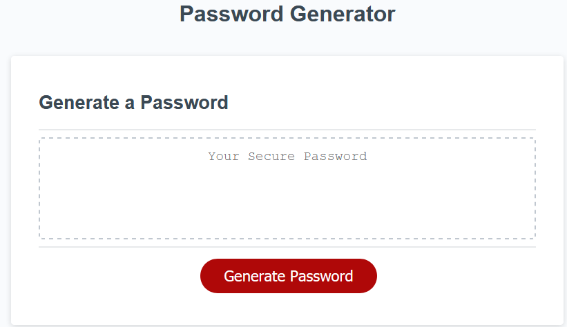

# Random_Password_Generator
## Description
This repository hosts a JavaScript based, random password generator. The coding languages used are HTML, CSS and JavaScript. The HTML and CSS files were already created and there were a few lines of code in the JavaScript file that connected the file to the HTML. Other than that, everything else was coded from scratch. 

The page contains a text area where the generated password will display once certain criteria are selected for in making a random password. To begin the process, the red "Generate Password" button is clicked. This brings up a prompt asking how many characters the password should be. If anything other than a number between 8-128 is chosen, the user is asked again to select an appropriate number.

Once a password length has been determined, an alert explaining the next steps appears explaining that there are four criteria that may be applied to the password and that at least one criteria must be selected or the criteria will cycle through again until one is selected. These criteria are whether the password should contain:
1. lowercase characters
2. uppercase characters
3. number characters
4. special characters

After at least one criteria has been selected and all four of the criteria have been asked, a randomly generated password is displayed in the text area according to the user's preferences.

## Producing Alerts
In order to produce one of the two error messages while generating the password, one of two things must occur:
1. When the prompt asking for password length appears, input anything that is not a whole number integer between 8-128. This includes letters, special characters, numbers outside of the specified range or numbers with decimals.
2. When cycling through the four criteria, select cancel on all inputs and the alert message will appear and ask for at least one selection.

## Live Link
https://riraq.github.io/Random_Password_Generator/

## Screenshots
### Index Page

### Password Length Prompt

### Explanation of Criteria

### First Password Criteria

### Second Password Criteria

### Third Password Criteria

### Fourth Password Criteria

### Example of Generated Password

### Incorrect Password Length Alert 

### Incorrect Criteria Selection Alert
